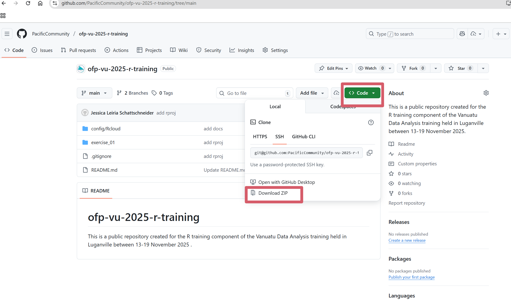

# RCloud Cheatsheet

This short guide shows you how to access all the material used in the Vanuatu Data Analysis Training during the R sessions of the workshop.

**In order to run the R scrips you need to make sure you have R and RStudio installed in your computer**. If you don't have these yet, you can install them first (to learn how to do this, please refer to [this tutorial](https://rstudio-education.github.io/hopr/starting.html)) or use RCloud instead (if you prefer this option, please follow the [RCloud tutorial](https://github.com/PacificCommunity/ofp-vu-2025-r-training/blob/main/config/Rcloud/README.md) in this repository).

**What you’ll do in this guide**

1. **Create a new folder in your computer**: create a new folder where you will keep the workshop material. Choose a location that is easy to find.

1. **Download the workshop material**: and unzip it to the new folder in your PC (step above)

1. Create a new folder on your computer

    - Go to the location where you want the folder (e.g., Desktop, Documents).

    - Right-click on an empty area.

    - Select New → Folder.

    - Type a name for the folder (e.g., workshop_material) and press Enter.

2. Download the workshop material and unzip it Download

- Click [here](https://github.com/PacificCommunity/ofp-vu-2025-r-training/tree/main) to go to the Github repository where the workshop material is maintained

- Click the arrow located in the green button (`<> Code`)  located in the top-right corner and from the new window select the option `Download ZIP` (see screenshot below).

Your browser will download the file to your `Downloads` folder unless you choose a different location.

- Open your Downloads folder (or the folder where your browser saved the file).

- Drag the downloaded ZIP file into the folder you created in the previous step.

- Once the ZIP file is inside your workshop folder, unzip it:

    - Right-click the ZIP file.

    - Select `Extract All`….

    - Choose the current workshop folder where you pasted the ZIP file.

    - Click Extract.
