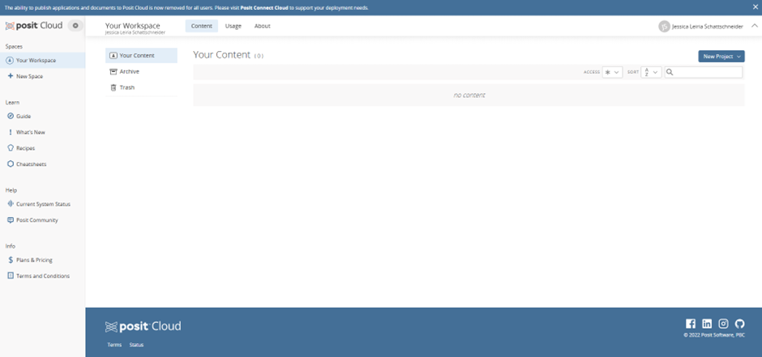
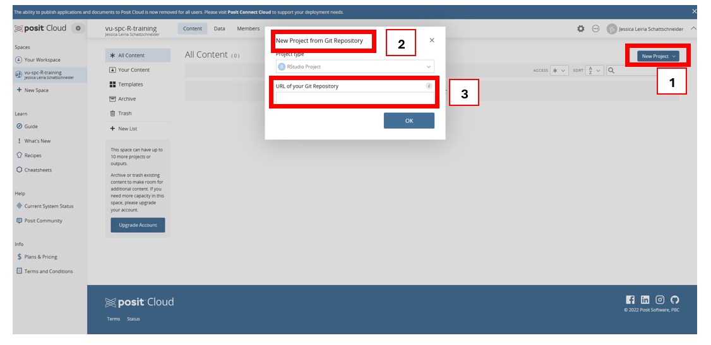

# RCloud Cheatsheet

This short guide shows you how to get everything ready to start using R in the cloud. No installations, no setup required!

By the end, you’ll have your own **RCloud workspace** (*think of it as your online R*) and a project that contains all the materials for this training.

You’ll be able to run R code directly in your browser, just like working in Word or Excel online.

- 🕒 Setup time: about 5–10 minutes

- ✅ You only need to do this once: after that, you’ll be ready to jump straight into the training or create your own future projects.

**What you’ll do in this guide**

1. **Create a Free RCloud Account**: so you can log in and save your work.

1. **Create a New Workspace**: your personal space for projects.

1. **Create a New Project**: your copy of the training materials (or any other R project you want to start).


## 1. Create a Free RCloud Account

If this is your first time using [Posit Cloud (formerly RCloud)](https://posit.cloud/plans/free), you’ll need to create an account.

*If you already have an account, skip ahead to the next section.*

**Steps:**

1. Go to https://posit.cloud/plans/free and click **Sign Up**.

1. Choose one of the following options:

    - Sign up with Google (fastest option), or

    - Sign up with email (recommended if you prefer to use your institutional email).

    

1. Check your email inbox and verify your email address.

    

1. Once verified, return to the website and click Continue.

1. You’re done! You’ll now be taken to your Posit Cloud workspace, where you can start working on your projects.

    

## 2. Create a New Workspace

A **workspace** in RCloud (Posit Cloud) is like a folder that holds all your projects. For this training, you’ll create a new workspace so your projects stay organised.

**Steps:**

1. In your RCloud dashboard, search for `Your Workspaces` in the left-hand menu and **click the blue `New Workspace`** button (red square in the screenshot below).

    

1. Give your workspace a simple name and click `Create`. For this training you can name your workspace like:
    
    ```
    vu-spc-R-training
    ```


You should then see the new Workspace in the left-hand menu.


## 3. Create a New Project

A project is where your R scripts, data, and results live.
In this step, you’ll create a new project that already includes all the materials for this training.

**Steps:**

1. Inside your workspace, click the blue `New Project` button (top right corner - see *box 1* in the screenshot below).

1. Select `New Project from Git Repository` (see *box 1* in the screenshot below).

1. When prompted for the repository URL, paste the link to this repository (see *box 3* in the screenshot below ):

    `https://github.com/PacificCommunity/ofp-vu-2025-r-training`

1. Click OK.




Wait a few moments while RCloud copies all the files.

Once it’s done, your project will open automatically and you are ready to explore and work with R!